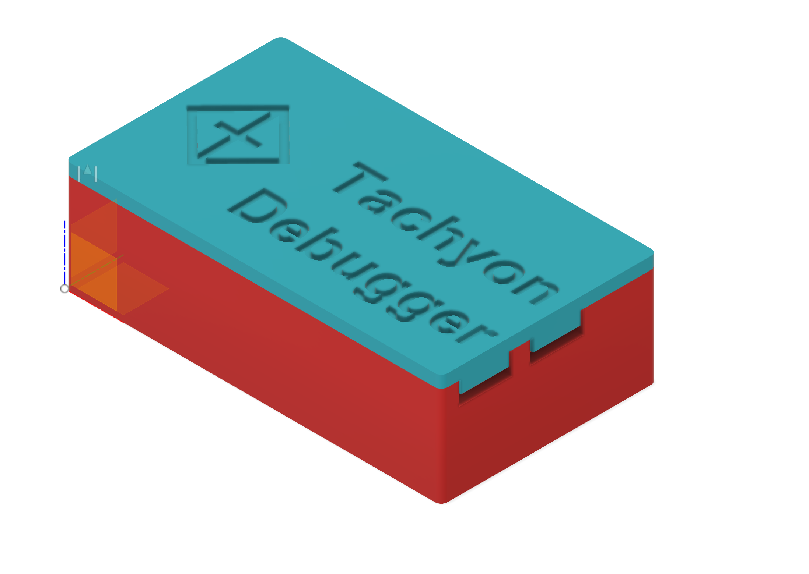
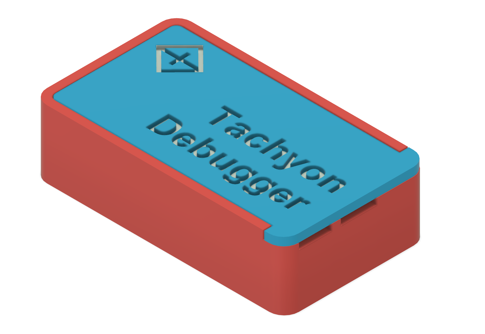
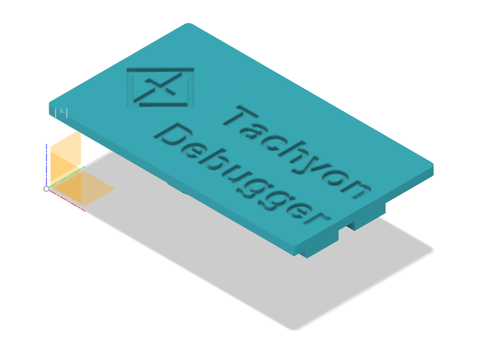
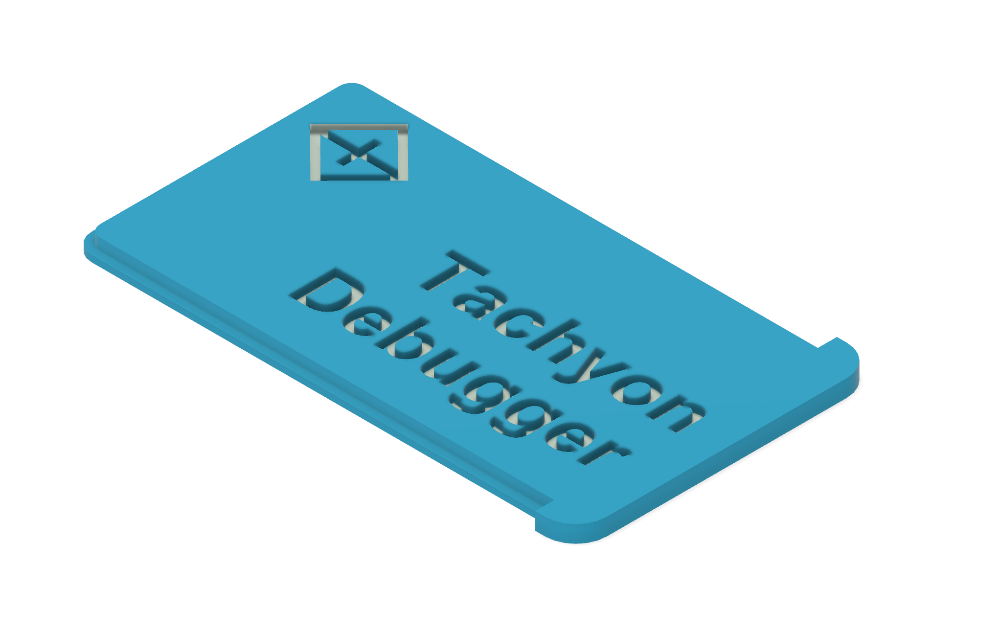
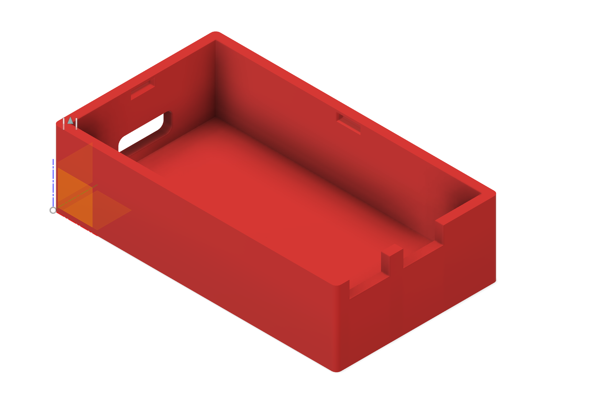
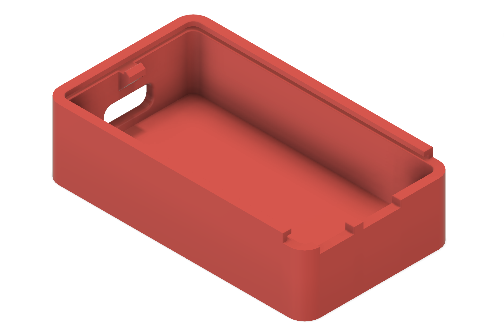

# tachyon-debug-case
3D print files based on the Tachyon [debugger](https://github.com/particle-iot-inc/tachyon-hw/tree/main/schematic-pcb/accessorial%20board/Debug%20Board/v0.3).

- Clip case
<!--  -->

- Slide case
<!--  -->

<!--   -->

# Top

 

  <strong>1：Clip-panel</strong>
  <strong>2：Slide-panel</strong>

<!-- - Clip-panel

- Slide-panel
 -->

# Bottom
<!-- - Clip-bottom

- Slide-base
 -->

 

  <strong>1：Clip-bottom</strong>
  <strong>2：Slide-base</strong>

